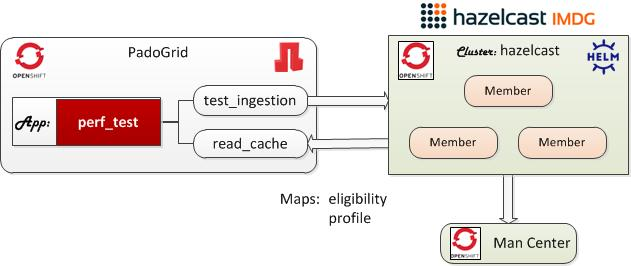

 [*PadoGrid*](https://github.com/padogrid) | [*Catalogs*](https://github.com/padogrid/catalog-bundles/blob/master/all-catalog.md) | [*Manual*](https://github.com/padogrid/padogrid/wiki) | [*FAQ*](https://github.com/padogrid/padogrid/wiki/faq) | [*Releases*](https://github.com/padogrid/padogrid/releases) | [*Templates*](https://github.com/padogrid/padogrid/wiki/Using-Bundle-Templates) | [*Pods*](https://github.com/padogrid/padogrid/wiki/Understanding-Padogrid-Pods) | [*Kubernetes*](https://github.com/padogrid/padogrid/wiki/Kubernetes) | [*Docker*](https://github.com/padogrid/padogrid/wiki/Docker) | [*Apps*](https://github.com/padogrid/padogrid/wiki/Apps) | [*Quick Start*](https://github.com/padogrid/padogrid/wiki/Quick-Start)

---

<!-- Platforms -->
[](https://github.com/padogrid/padogrid/wiki/Platform-PadoGrid-1.x) [](https://github.com/padogrid/padogrid/wiki/Platform-Host-OS) [](https://github.com/padogrid/padogrid/wiki/Platform-Kubernetes)

# Hazelcast OpenShift Helm Charts

This bundle deploys Hazelcast using Helm Charts with Prometheus metrics enabled. It also includes the PadoGrid container for ingesting mock data into the Hazelcast cluster.

For Prometheus instructions, please see the following link: [Configuring Prometheus Metrics](https://github.com/padogrid/bundle-hazelcast-3n4n5-k8s-oc_helm/blob/master/README-PROM.md).

## Installing Bundle

```bash
install_bundle -download bundle-hazelcast-3n4n5-k8s-oc_helm
```

## Use Case

This bundle installs PadoGrid and Hazelcast Kubernetes containers to run on OpenShift Local (CRC) or OpenShift Container Platform (OCP). It demonstrates how to start Hazelcast using Helm Charts and  use the PadoGrid pod to ingest mock data into Hazelcast.



## Required Software

- OpenShift Client, **oc**
- [Helm](https://helm.sh/docs/intro/install/), **helm**

## Directory Tree View

```console
oc_helm/
├── bin_sh
│   ├── build_app
│   ├── cleanup
│   ├── login_padogrid_pod
│   ├── setenv.sh
│   ├── start_hazelcast
│   ├── start_padogrid
│   ├── stop_hazelcast
│   └── stop_padogrid
├── etc
│   └── hazelcast-enterprise
│       ├── hz-secret.yaml
│       └── mc-secret.yaml
├── hazelcast
│   └── values.yaml
├── padogrid
│   ├── padogrid-no-pvc.yaml
│   └── padogrid.yaml
└── prometheus
    └── service-monitor.yaml
```

## 1. Build Local Environment

Run `build_app` which initializes your local environment. This script sets the license key in the `hazelcast/secret.yaml` file.

```bash
cd_k8s oc_helm/bin_sh
./build_app
```
### Changing Container Versions

The conatiner image versions can be changed as needed in the files shown below.

```bash
# Change dir to the k8s installation directory
cd_k8s oc_helm
```

| Container                     | File                   |
| ----------------------------- | ---------------------- |
| PadoGrid                      | padogrid/padogrid.yaml | 
| Hazelcast                     | hazelcast/values.yaml  | 

## 2. Create OpenShift Project

Let's create the `oc-helm` project. You can create a project with a different name but make sure replace `oc-helm` with your project name throughout this article.

```bash
oc new-project oc-helm
```

## 3. Add User to `nonroot` SCC (Security Context Constraints)

PadoGrid runs as a non-root user (padogrid/1001) that requires read/write permissions to the persistent volume. Let's add your project's default user to the `nonroot` SCC.

You can use one of the following methods to add the user to `nonroot` SSC.

### 3.1. Using Editor

```bash
oc edit scc nonroot
```

**nonroot SCC:**

Add your project under the`users:` section. For our example, since our project name is **oc-helm**, we would enter the following.

```yaml
users:
- system:serviceaccount:oc-helm:default
```

### 3.2. Using CLI

```bash
# See if user can use nonroot
oc adm policy who-can use scc nonroot

# Add user
oc adm policy add-scc-to-user nonroot system:serviceaccount:oc-helm:default
```

❗️ Note that depending on the `oc` version, e.g., **v4.5.9**, `oc get scc nonroot -o yaml` may not show the user you added using CLI. This is also true for the user added using the editor, which may not show in the output of `oc adm policy who-can use scc nonroot`.

## 4. Launch Hazelcast

By default, the `start_hazelcast` script launches Hazelcast Enterprise. To run, OSS, specify the `-oss` as shown in the sequent section.

### 4.1. Hazelcast OSS

```bash
cd_k8s oc_helm/bin_sh
./start_hazelcast -oss
```

Hazelcast has been configured with `securityContext` enabled. It might fail to start due to the security constraint set by `fsGroup`. Check the StatefulSet events using the describe command as follows.

```bash
oc describe statefulset oc-helm-hazelcast
```

Output:

```console
...
Events:
  Type     Reason        Age                 From                    Message
  ----     ------        ----                ----                    -------
  Warning  FailedCreate  22s (x14 over 63s)  statefulset-controller  create Pod oc-helm-hazelcast-0 in StatefulSet oc-helm-hazelcast failed error: pods "oc-helm-hazelcast-0" is forbidden: unable to validate against any security context constraint: [fsGroup: Invalid value: []int64{1000690000}: 1000690000 is not an allowed group spec.containers[0].securityContext.securityContext.runAsUser: Invalid value: 1000690000: must be in the ranges: [1000570000, 1000579999]]
```

If you see the warning event similar to the above then you need to enter the valid value in the `hazelcast/values.yaml` file as follows.

```bash
cd_k8s oc_helm
vi hazelcast/values.yaml
```

For our example, we would enter a valid value in the `values.yaml` file as follows.

```yaml
# Security Context properties
securityContext:
  # enabled is a flag to enable Security Context
  enabled: true
  # runAsUser is the user ID used to run the container
  runAsUser: 1000570000
  # runAsGroup is the primary group ID used to run all processes within any container of the pod
  runAsGroup: 1000570000
  # fsGroup is the group ID associated with the container
  fsGroup: 1000570000
...
```

After making the changes, restart (stop and start) the Hazelcast cluster as follow.

```bash
cd_k8s oc_helm; cd bin_sh
./stop_hazelcast -oss
./start_hazelcast -oss
```

Watch pods.

```bash
oc get pods -w
```

### 4.1.1. Hazelcast Management Center

View the Hazelcast services.

```bash
oc get svc
```

Output:

```console
NAME                          TYPE           CLUSTER-IP      EXTERNAL-IP   PORT(S)                        AGE
oc-helm-hazelcast             ClusterIP      None            <none>        5701/TCP                       8s
oc-helm-hazelcast-mancenter   LoadBalancer   172.30.239.38   <pending>     8080:30974/TCP,443:30853/TCP   8s
```

We can open Management Center via HTTP or HTTPS. Follow the instructions in one of the subsequent sections.

#### 4.1.1.1. HTTP

Run `oc expose svc` to expose services.

```bash
oc expose -l app=hazelcast svc oc-helm-hazelcast-mancenter
```

Run `oc get route` to get the Management Center URL.

```bash
oc get route
```

Output:

```console
NAME                          HOST/PORT                                              PATH   SERVICES                      PORT   TERMINATION   WILDCARD
oc-helm-hazelcast-mancenter   oc-helm-hazelcast-mancenter-oc-helm.apps-crc.testing          oc-helm-hazelcast-mancenter   http                 None
```

- HTTP URL: http://oc-helm-hazelcast-mancenter-oc-helm.apps-crc.testing

### 4.2. Hazelcast Enterprise

Launch Hazelcast Enterprise Operator and Hazelcast.

```bash
cd_k8s oc_helm; cd bin_sh
./start_hazelcast
```

Hazelcast has been configured with `securityContext` enabled. It might fail to start due to the security constraint set by `fsGroup`. Check the StatefulSet events using the describe command as follows.

```bash
oc describe statefulset oc-helm-hazelcast
```

Output:

```console
...
Events:
  Type     Reason        Age                 From                    Message
  ----     ------        ----                ----                    -------
  Warning  FailedCreate  22s (x14 over 63s)  statefulset-controller  create Pod oc-helm-hazelcast-enterprise-0 in StatefulSet oc-helm-hazelcast-enterprise failed error: pods "oc-helm-hazelcast-enterprise-0" is forbidden: unable to validate against any security context constraint: [fsGroup: Invalid value: []int64{1000690000}: 1000690000 is not an allowed group spec.containers[0].securityContext.securityContext.runAsUser: Invalid value: 1000690000: must be in the ranges: [1000570000, 1000579999]]
```

If you see the warning event similar to the above then you need to enter the valid value in the `hazelcast/values.yaml` file as follows.

```bash
cd_k8s oc_helm
vi hazelcast/values.yaml
```

For our example, we would enter a valid value in the `values.yaml` file as follows.

```yaml
# Security Context properties
securityContext:
  # enabled is a flag to enable Security Context
  enabled: true
  # runAsUser is the user ID used to run the container
  runAsUser: 1000570000
  # runAsGroup is the primary group ID used to run all processes within any container of the pod
  runAsGroup: 1000570000
  # fsGroup is the group ID associated with the container
  fsGroup: 1000570000
...
```

After making the changes, restart (stop and start) the Hazelcast cluster as follow.

```bash
cd_k8s oc_helm; cd bin_sh
./stop_hazelcast
./start_hazelcast
```

Watch pods.

```bash
oc get pods -w
```

### 4.2.1. Hazelcast Management Center

View the Hazelcast services.

```bash
oc get svc
```

Output:

```console
NAME                                     TYPE           CLUSTER-IP      EXTERNAL-IP   PORT(S)                        AGE
oc-helm-hazelcast-enterprise             ClusterIP      None            <none>        5701/TCP                       7m8s
oc-helm-hazelcast-enterprise-mancenter   LoadBalancer   172.30.178.54   <pending>     8080:30179/TCP,443:32291/TCP   7m8s
```

We can open Management Center via HTTP or HTTPS. Follow the instructions in one of the subsequent sections.

#### 4.2.1.1. HTTP

Run `oc expose svc` to expose the Management Center service.

```bash
oc expose -l app=hazelcast svc oc-helm-hazelcast-enterprise-mancenter
```

Run `oc get route` to get the Management Center URL.

```bash
oc get route
```

Output:

```console
NAME                                     HOST/PORT                                                         PATH   SERVICES                                 PORT   TERMINATION   WILDCARD
oc-helm-hazelcast-enterprise-mancenter   oc-helm-hazelcast-enterprise-mancenter-oc-helm.apps-crc.testing          oc-helm-hazelcast-enterprise-mancenter   http                 None
```

- HTTP URL: <http://oc-helm-hazelcast-enterprise-mancenter-oc-helm.apps-crc.testing>

### 4.3. Hazelcast Management Center HTTPS

We can use the edge termination to access the management center via HTTPS. The [Red Hat OpenShift documentation](https://docs.openshift.com/dedicated/networking/routes/secured-routes.html#nw-ingress-creating-an-edge-route-with-a-custom-certificate_secured-routes) states, "With an edge route, the Ingress Controller terminates TLS encryption before forwarding traffic to the destination pod." This essentially means, beyond the termination point, the internal network traffic is not encrypted so that we can run the Management Center pod without HTTPS enabled.

First, we need to create a self-signed certificate. The following creates an RSA key and certificate `etc/tls` directory. Note that it sets CN (Common Name) to `*.demo.com` so that we can use it as a domain name for assigning any hosts.

```bash
cd_k8s oc_helm
mkdir etc/tls
openssl req -newkey rsa:4096 -x509 -sha256 -days 365 -nodes \
    -out etc/tls/tls.crt -keyout etc/tls/tls.key -subj "/CN=*.demo.com"
```

Now, expose the management center service with the edge termination. Let's assign the hostname to `mancenter.demo.com` as follows.

- Hazelcast OSS

```bash
oc create route edge tls-mancenter --service=oc-helm-hazelcast-mancenter \
    --hostname=mancenter.demo.com --port 8080 --cert etc/tls/tls.crt --key etc/tls/tls.key
```

- Hazelcast Enterprise

```bash
oc create route edge tls-mancenter --service=oc-helm-hazelcast-enterprise-mancenter \
    --hostname=mancenter.demo.com --port 8080 --cert etc/tls/tls.crt --key etc/tls/tls.key
```

Assuming you are using OpenShift Local, open `/etc/hosts` and look for the IP address that has `crc` host names assigned. We need to append `mancenter.demo.com` to that IP address.

```bash
sudo vi /etc/hosts
```

Append `mancenter.demo.com` the IP address that has `crc` host names assigned in `/etc/hosts`:

```console
<ip-address> ... api.crc.testing ... mancenter.demo.com
```

Run `oc get route` to get the Management Center URL:

```bash
oc get route
```

- Hazelcast OSS

```console
NAME            HOST/PORT            PATH   SERVICES                      PORT   TERMINATION   WILDCARD
tls-mancenter   mancenter.demo.com          oc-helm-hazelcast-mancenter   8080   edge          None
```

- Hazelcast Enterprise


```console
NAME            HOST/PORT            PATH   SERVICES                                 PORT   TERMINATION   WILDCARD
tls-mancenter   mancenter.demo.com          oc-helm-hazelcast-enterprise-mancenter   http   edge          None
```

- HTTPS URL: <https://mancenter.demo.com>

## 5. Launch PadoGrid

### 5.1. OpenShift Local Users

```bash
cd_k8s oc_helm; cd bin_sh

# If you have not created local-storage
./start_padogrid
```

### 5.2. OCP Users

```bash
cd_k8s oc_helm; cd bin_sh
./start_padogrid
```

## 6. Login to PadoGrid

You can use the PadoGrid pod as a client to the Hazelcast cluster. There are three (3) ways to login to the PadoGrid pod. Please follow the instructions in one of the subsequent sections.

### 6.1. HTTP

The PadoGrid container is equipped with JupyterLab. The `start_padogrid` script has already exposed the `padogrid-service` so that we can immediately login to PadoGrid from the browser.

```bash
oc get route padogrid-service
```

Output:

```console
NAME               HOST/PORT                                   PATH   SERVICES           PORT   TERMINATION   WILDCARD
padogrid-service   padogrid-service-oc-helm.apps-crc.testing          padogrid-service   http                 None
```

- **URL:** <http://padogrid-service-oc-helm.apps-crc.testing>
- **Password:** padogrid

### 6.2. HTTPS

If you want to access PadoGrid via HTTPS, then we need to terminate TLS as we did for the Management Center earlier.

```bash
cd_k8s oc_helm
oc create route edge tls-padogrid --service=padogrid-service \
    --hostname=padogrid.demo.com --port 8888 --cert etc/tls/tls.crt --key etc/tls/tls.key
```

Assuming you are using OpenShift Local, open `/etc/hosts` and look for the IP address that has `crc` host names assigned. We need to append `padogrid.demo.com` to that IP address.

```bash
sudo vi /etc/hosts
```

Append `mancenter.demo.com` the IP address that has `crc` host names assigned in `/etc/hosts`:

```console
<ip-address> ... api.crc.testing ... mancenter.demo.com padogrid.demo.com
```

Run `oc get route` to get the Management Center URL:

```bash
oc get route tls-padogrid
```

```console
NAME           HOST/PORT           PATH   SERVICES           PORT   TERMINATION   WILDCARD
tls-padogrid   padogrid.demo.com          padogrid-service   http   edge          None
```

- **HTTPS URL:** <https://padogrid.demo.com>
- **Password:** padogrid

### 6.3. Shell

From your shell, run the `login_padogrid_pod` script as follows.

```bash
cd_k8s oc_helm/bin_sh
./login_padogrid_pod
```

## 7. Ingest Data

Login to the PadoGrid pod using one of the options described in [Section 6](#6-login-to-padogrid).

The `start_padogrid` script automatcially sets the Hazelcast service and the namespace for constructing the DNS address needed by the `perf_test` app to connect to the Hazelcast cluster. This allows us to simply login to the PadoGrid pod and run the `perf_test` app.

*If `perf_test` fails to connect to the Hazelcst cluster then you may need to manually configure the Hazelcast client as described in the [next section](#8-manually-configuring-perf_test).*

Create and run the `perf_test` app.

```bash
# First, change cluster context to the default cluster, 'myhz' so
# that we can create and run Hazelcast apps.
switch_cluster myhz

# Create 'perf_test' app
create_app
cd_app perf_test; cd bin_sh

# Ingest blob data into Hazelcast.
./test_ingestion -run
```

Read ingested data.

```bash
cd_app perf_test; cd bin_sh
./read_cache eligibility
./read_cache profile
```

The `elibility` and `profile` maps contain blobs. They are meant for carrying out performance tests with different payload sizes. If you want to ingest non-blobs, then you can ingest the Northwind (nw) data generated by PadoGrid. To do so, you must first build the `perf_test` app and run the `test_group` script as shown below.

```bash
cd_app perf_test; cd bin_sh
./build_app

# After the build, run test_group
./test_group -run -prop ../etc/group-factory.properties
```

Read the **nw** data:

```bash
./read_cache nw/customers
./read_cache nw/orders
```

Exit from the PadoGrid pod.

```bash
exit
```

## 8. Manually Configuring `perf_test`

The `test_ingestion` script may fail to connect to the Hazelcast cluster if you started the PadoGrid pod before the Hazelcast cluster is started. In that case, you can simply restart PadoGrid. If it still fails even after the Hazelcast cluster has been started first, then you can manually enter the DNS address in the `etc/hazelcast-client-k8s.xml` file as described below.

```bash
cd_app perf_test
vi etc/hazelcast-client-k8s.xml
```

### 8.1. Hazelcast OSS

Enter the following in the `etc/hazelcast-client-k8s.xml` file. `oc-helm-hazelcast` is the service and  `oc-helm` is the project name.

```xml
                <kubernetes enabled="true">
                        <service-dns>oc-helm-hazelcast.oc-helm.svc.cluster.local</service-dns>
                </kubernetes>
```

### 8.2. Hazelcast Enterprise

Enter the following in the `etc/hazelcast-client-k8s.xml` file. `oc-helm-hazelcast-enterprise` is the service and  `oc-helm` is the project name.

```xml
                <kubernetes enabled="true">
                        <service-dns>oc-helm-hazelcast-enterprise.oc-helm.svc.cluster.local</service-dns>
                </kubernetes>
```

## 9. Teardown

### 9.1. Hazelcast OSS

```bash
cd_k8s oc_helm; cd bin_sh
./cleanup -all -oss
```

### 9.2. Hazelcast Enterprise

```bash
cd_k8s oc_helm/bin_sh
./cleanup -all
```

## 10. References

1. Hazelcast Charts, [https://github.com/hazelcast/charts](https://github.com/hazelcast/charts)
2. Configuring Prometheus Metrics, [README-PROM.md](README-PROM.md).

---

 [*PadoGrid*](https://github.com/padogrid) | [*Catalogs*](https://github.com/padogrid/catalog-bundles/blob/master/all-catalog.md) | [*Manual*](https://github.com/padogrid/padogrid/wiki) | [*FAQ*](https://github.com/padogrid/padogrid/wiki/faq) | [*Releases*](https://github.com/padogrid/padogrid/releases) | [*Templates*](https://github.com/padogrid/padogrid/wiki/Using-Bundle-Templates) | [*Pods*](https://github.com/padogrid/padogrid/wiki/Understanding-Padogrid-Pods) | [*Kubernetes*](https://github.com/padogrid/padogrid/wiki/Kubernetes) | [*Docker*](https://github.com/padogrid/padogrid/wiki/Docker) | [*Apps*](https://github.com/padogrid/padogrid/wiki/Apps) | [*Quick Start*](https://github.com/padogrid/padogrid/wiki/Quick-Start)
